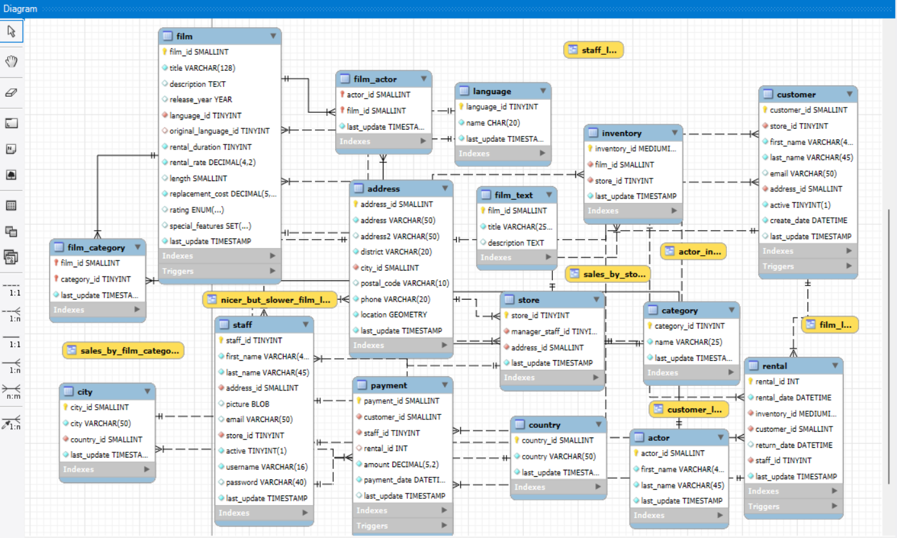

# Sakila Database SQL Practice 🚀

Welcome to my Sakila Database project! This repository contains a series of SQL queries I practiced using the **Sakila Sample Database** in **MySQL Workbench**. The Sakila schema is a great resource to explore real-world relationships between entities like films, actors, customers, rentals, and payments.

---

## 📘 About the Sakila Database

The Sakila Database is a sample database provided by MySQL that simulates a DVD rental store. It contains information about:

- Movies (films)
- Actors and categories
- Stores and inventory
- Customers and their rentals
- Payments, staff, and addresses

---

## 🧠 ER Diagram

Below is the **Entity-Relationship Diagram** of the Sakila database used for reference during query creation:

---

## 📂 Files in This Repository

- `sakila_practice_queries.sql`: Contains all the queries I practiced (listed below).
- `sakila-schema.sql` and `sakila-data.sql`: These are the original schema and data files provided by MySQL to set up the Sakila database.
- `Sakila Database Entity Relationship Diagram.png`: Screenshot of the ER diagram.

---

## 📊 SQL Queries Practiced

Here is a summary of the queries included in `sakila_practice_queries.sql`:

1. 🎬 All PG-13 films with a rental rate of $2.99 or lower
2. 🎞️ Films that include **deleted scenes**
3. ✅ All **active customers**
4. 📅 Customers who rented a movie on **26th July 2005**
5. 🔁 **Distinct** customers who rented on 26th July 2005
6. 📈 Rental **count per day** + Busiest day
7. 👽 All **Sci-Fi** films in the catalogue
8. 🎥 Number of movies each customer has rented
9. ❌ Films with **less than or equal to 5 rentals** (suggested for removal)
10. 📦 Movies that are **not returned yet**
11. 💸 Daily **revenue and rental count** for Store 1
12. 🏆 Top **3 earning days** based on rental payments

Each query has been commented and structured clearly in the SQL file for easy understanding.

---

